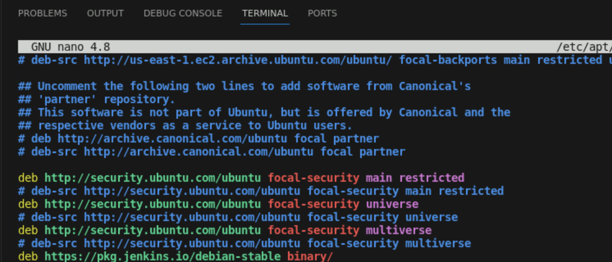
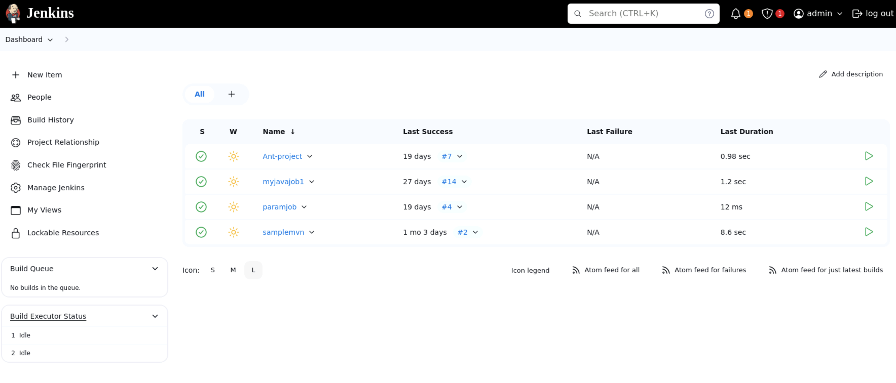
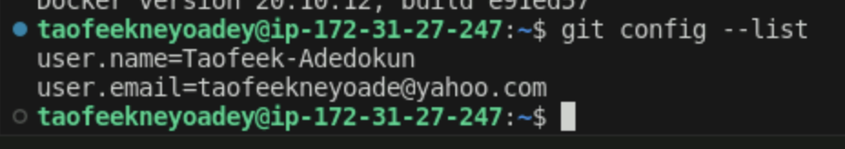
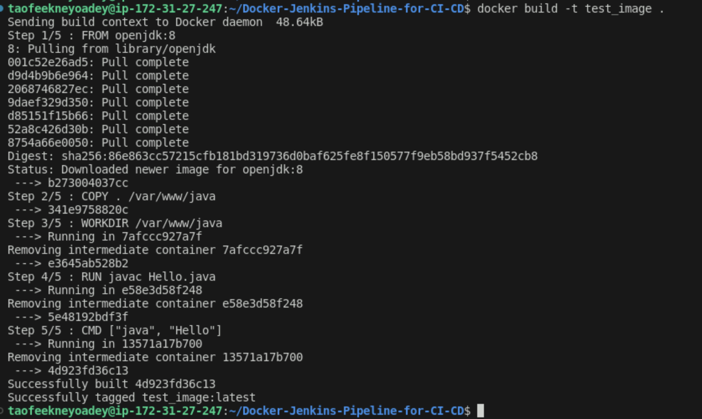
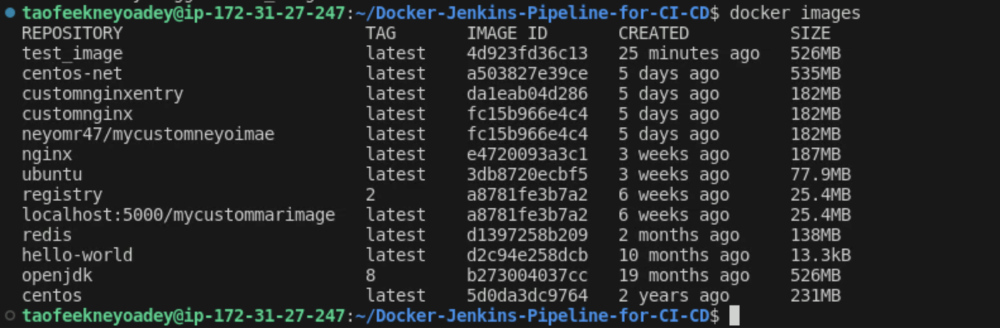
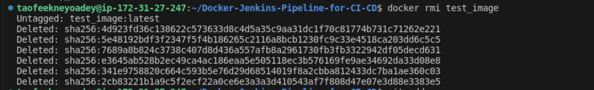
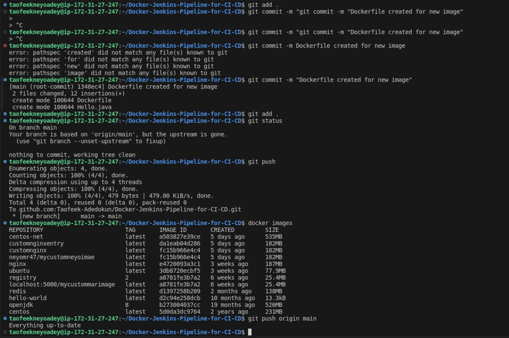
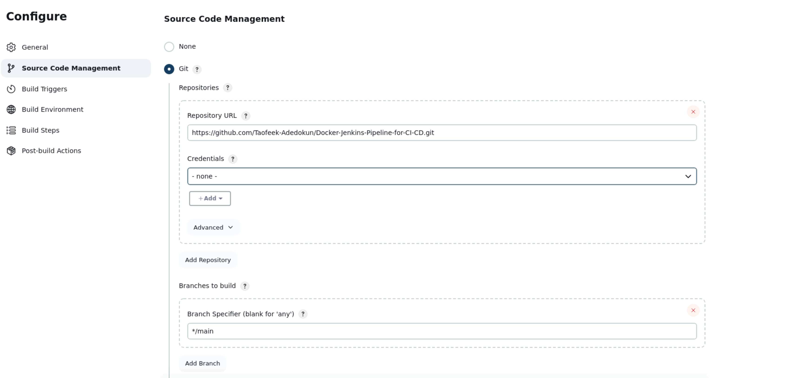
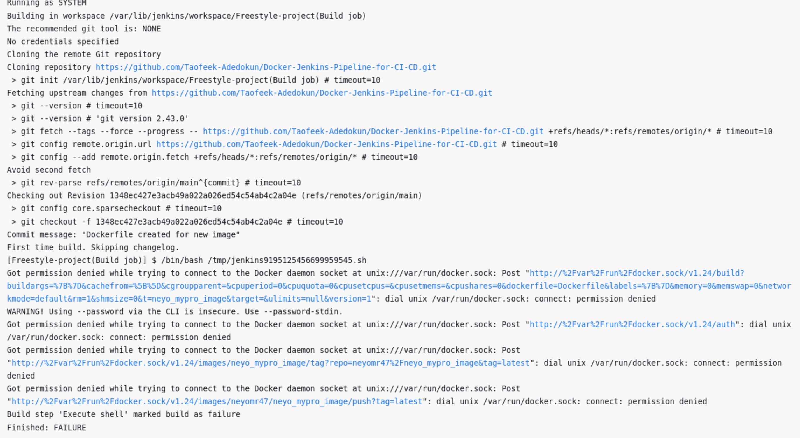
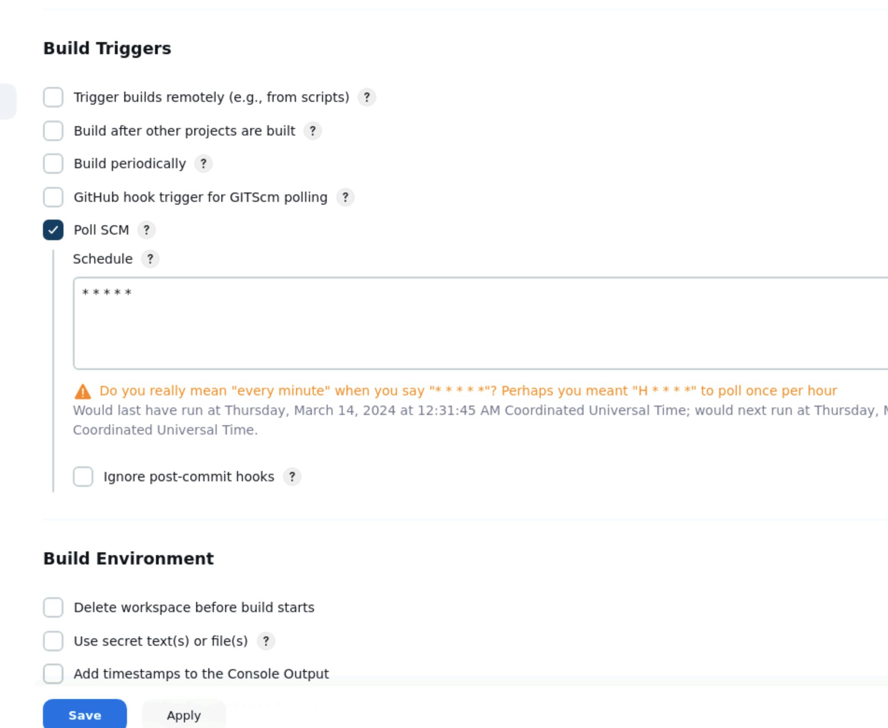

## This project implements a Docker Jenkins Pipeline for CI/CD, utilizing Docker, GitHub, Docker Hub, and Jenkins. It automates build, test, and deployment processes, ensuring efficient version tracking and high-quality product delivery.

## Installation Of Pre-requisites/ Tools Needed For The Implementation Of The Project

1. Install and check java (1.8)

  `sudo apt update`

  `sudo apt install -y openjdk-8-jdk`

  `java -version`

2.  Install & check jenkins (make sure to check whether jenkins is running on port 8080)

- Add the Jenkins key:

 ` wget -q -O – https://pkg.jenkins.io/debian-stable/jenkins.io.key | sudo     apt-key add –`

-  Add the jenkins pkg repo to package manager:
    Edit the file:

    `sudo nano /etc/apt/sources.list`

-   Add this line at the end of the file and save it:

    `deb https://pkg.jenkins.io/debian-stable binary/`

    

- Execute:

    `sudo apt-get update`

- Install Jenkins:

`sudo apt-get install -y jenkins`

-  Manually restart the jenkins server:

`sudo systemctl restart jenkins`

3. Install & check Docker

`sudo apt-get update`

`sudo apt-get install -y docker.io`

`docker --version`

4. Install & check git
    
    `sudo apt-get update`

    `sudo apt-get install -y git`

   - Verify git installation

    `git --version`

   - Configure git

    `git config --global user.email "YOUR_EMAIL_ID`
    
    `git config --global user.name "YOUR_USER_NAME`

    `git config --list`

    

  -  Create a GitHub repository under your account

  - Your_github_project_url

   `git@github.com:Taofeek-Adedokun/-Docker-Jenkins-Pipeline-for-CI-CD.git`

   

 -  Clone your repository in your linux machine

 `git clone git@github.com:Taofeek-Adedokun/Docker-Jenkins-Pipeline-for-CI-CD.git` 

 `cd Docker-Jenkins-Pipeline-for-CI-CD`

 

 ## Create the files required inside this local repo. Check whether the Dockerfile is working without any error and able to build image.

`nano Dockerfile`

 FROM openjdk:8

  COPY . /var/www/java

  WORKDIR /var/www/java

  RUN javac Hello.java

  CMD ["java", "Hello"]

  `cd ..`

  `nano Hello.java`

  class Hello {
    public static void main(String[] args) {
      System.out.println("This is a java app created using Docker");
    }
  }
### Test the image creation:

`docker build -t test_image .`

`docker images`

`docker rmi test_image`

###  Add the files to the local repo, commit the changes & push the changes to remote repo. And make sure the changes are reflected in the remote repo

`git add .`

`git commit -m "Dockerfile created for new image`

`git push origin main`

## Open Jenkins, create a freestyle project. Use the Github url as the SCM. In the build section execute docker build command to test whether jenkins is able to execute it.

- Jenkins > New Item > Freestyle project (BuildJob)

- SCM > Git > https://github.com/Taofeek-Adedokun Docker-Jenkins-Pipeline-for-CI-CD.git

   
- Build > Add build step > Execute Shell
    `docker build -t neyo_mypro_image .`

    `docker login -u neyomr47 -p *******`

`docker tag neyo_mypro_image neyomr47/neyo_mypro_image:latest`

`docker push neyomr47/neyo_mypro_image:latest`

 - Save
  - Build the Job

    - Check the build console. If you get permission error, execute the below steps

    

    `sudo usermod -aG docker jenkins`

- Restart Jenkins

    `sudo systemctl restart jenkins`

    `sudo chmod 777 /var/run/docker.sock`

- Relogin & build the job once again

  `docker images`

### Automate the process using Jenkins Build Trigger

  - Automate

  - Build Trigger

  - Poll SCM - duration * * * * *

  

  

### In conclusion, the implementation of the Docker Jenkins Pipeline marks a pivotal achievement in enabling continuous integration and delivery. By leveraging Docker, GitHub, Docker Hub, and Jenkins, we've streamlined development workflows and ensured efficient version tracking.

  

   

   

